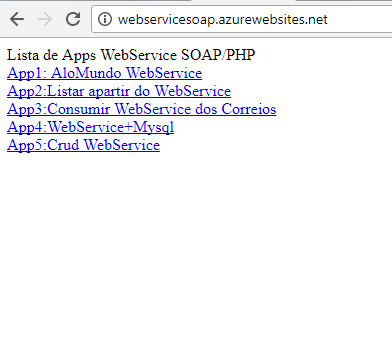
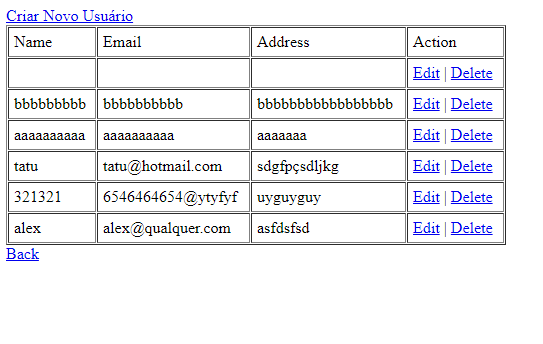

# WebServerPHP

Respositorio de webservices tipo soap para PHP:

No server1: tem um ola mundo simples apenas para introduzir ao estudo do webserices

No server2: preencho uma tag select pelo webservice

No server3: utilizo eu consumo o webservice dos correios para calcular o preco e estimativa de um encomenda dos correios

No server4: populo uma tag select pelo webservice com uma base de dados externa

No server5: Um crud simples no qual é possivel inserir, editar, listar, excluir dados de um usuário

Outros webservie de maior complexidade poderam ser inserido no repositorio

  
  

